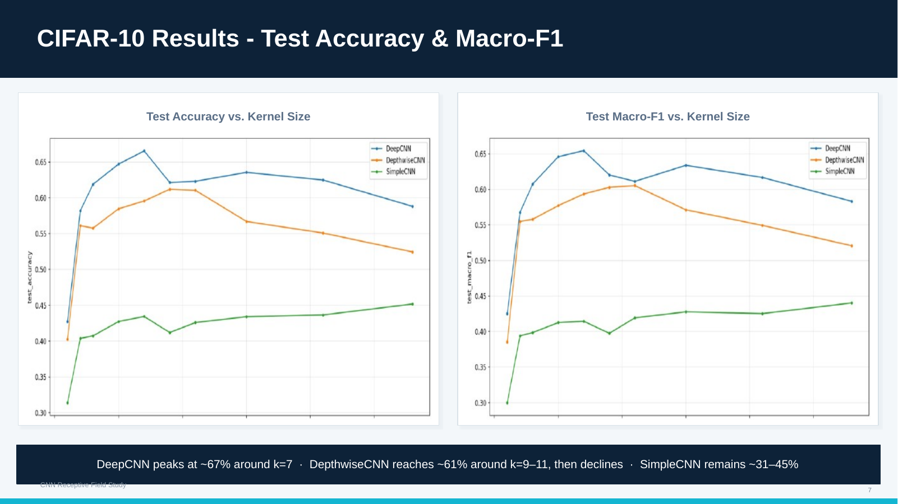
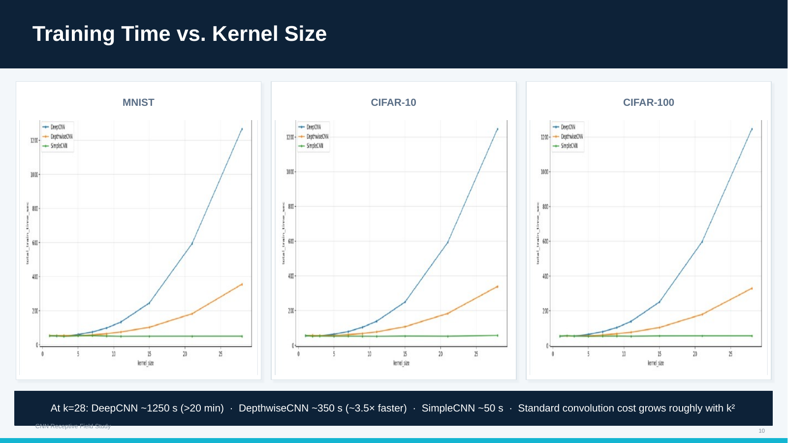
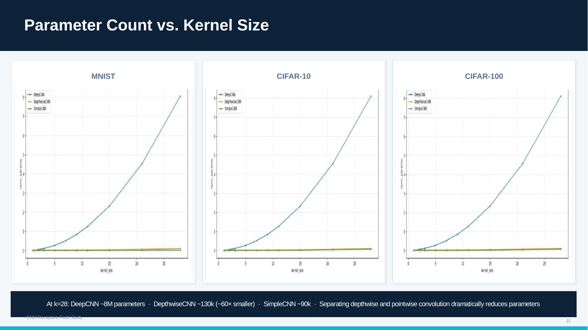
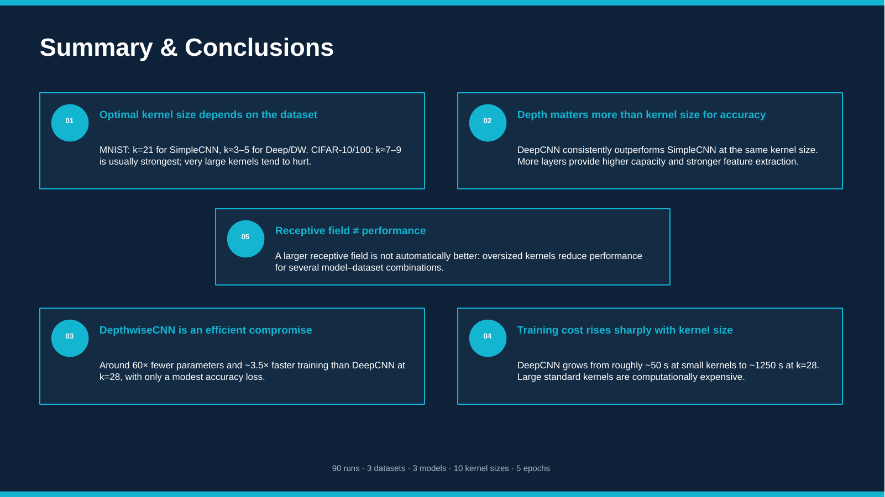

# CNN Receptive Field Study

A small empirical study of how convolutional kernel size affects classification performance and computational efficiency across different CNN architectures.

The experiments compare three datasets, three CNN architectures, and ten kernel sizes, resulting in **90 training configurations**.

## Study design

- **Datasets:** MNIST, CIFAR-10, CIFAR-100
- **Architectures:** SimpleCNN, DeepCNN, DepthwiseCNN
- **Kernel sizes:** `1, 2, 3, 5, 7, 9, 11, 15, 21, 28`
- **Optimizer:** AdamW
- **Loss:** CrossEntropyLoss
- **Training:** 5 epochs per configuration
- **Metrics:** accuracy, macro-F1, parameter count, training time, and convolution-stack receptive field

All models use Global Average Pooling (GAP), allowing the same implementations to work with both 28×28 MNIST and 32×32 CIFAR images.

## Research question

How does increasing convolutional kernel size affect classification performance, model size, and training cost, and how do standard and depthwise-separable convolutions behave under the same setting?

## Results

The original 5-epoch experiments showed the following trends:

- **MNIST:** DeepCNN and DepthwiseCNN reached approximately 97–99% accuracy from `k=3`, while SimpleCNN benefited more strongly from larger kernels and performed best around `k=21`.
- **CIFAR-10:** DeepCNN performed best around `k=7` at approximately 67% accuracy. DepthwiseCNN reached around 61% at `k=9–11`.
- **CIFAR-100:** DeepCNN peaked around `k=9` at approximately 30%, while very large kernels generally reduced performance.
- **Efficiency:** at `k=28`, DeepCNN had roughly 8M parameters compared with about 130k for DepthwiseCNN. The corresponding measured training times were approximately 1250 s and 350 s.

Overall, increasing the receptive field did not consistently improve classification accuracy. Model depth and the way spatial filtering is implemented had a larger effect than simply increasing kernel size.

<p align="center">
  
</p>

The values above are taken from the original experiment summary and presentation. Running the experiment grid again generates a new `results_all.csv` with the complete measurements.

## Models

### SimpleCNN

A shallow baseline with a single kernel-size-dependent convolutional layer followed by MaxPool, Global Average Pooling, and a small fully connected classifier.

```text
Conv(k) → BatchNorm → ReLU → MaxPool → GAP → FC → FC
```

### DeepCNN

A three-layer convolutional network with channel dimensions:

```text
32 → 64 → 128
```

It provides the highest model capacity, but its parameter count and computational cost increase rapidly as kernel size grows.

### DepthwiseCNN

A three-block depthwise-separable CNN.

Each block separates spatial filtering from channel mixing:

```text
Depthwise Conv(k) → BatchNorm → ReLU
        ↓
Pointwise Conv(1×1) → BatchNorm → ReLU
```

This makes large kernels substantially more parameter-efficient than standard convolutions.

## Efficiency

### Training time

<p align="center">
  
</p>

### Parameter count

<p align="center">
  
</p>

Training times depend on the hardware used, while parameter-count trends follow directly from the model architectures.

## Repository structure

```text
cnn-receptive-field-study/
├── README.md
├── LICENSE
├── requirements.txt
├── run_experiments.py
│
├── src/
│   ├── __init__.py
│   ├── data.py
│   ├── models.py
│   ├── plotting.py
│   └── training.py
│
├── tests/
│   └── test_models.py
│
├── results/
│   ├── README.md
│   └── reported_findings.md
│
├── figures/
│   ├── mnist_results.png
│   ├── cifar10_results.png
│   ├── cifar100_results.png
│   ├── training_time.png
│   ├── parameter_count.png
│   └── summary.png
│
└── presentation/
    ├── receptive_field_study_en.pdf
    └── receptive_field_study_en.pptx
```

## Installation

Clone the repository:

```bash
git clone https://github.com/AndrasBajnokSzabo/cnn-receptive-field-study.git
cd cnn-receptive-field-study
```

Create a virtual environment:

```bash
python -m venv .venv
```

Activate it on Linux/macOS:

```bash
source .venv/bin/activate
```

or on Windows:

```powershell
.venv\Scripts\activate
```

Install the dependencies:

```bash
pip install -r requirements.txt
```

## Running the experiments

### Full experiment

Runs all three datasets, all three models, and all ten kernel sizes:

```bash
python run_experiments.py --epochs 5
```

### Quick test run

Useful for checking that the pipeline works before launching the full experiment:

```bash
python run_experiments.py --epochs 1 --subset_train 5000 --subset_test 1000 --max_kernel 7
```

### Single dataset and model

```bash
python run_experiments.py --datasets MNIST --models SimpleCNN --epochs 5
```

### CPU only

```bash
python run_experiments.py --cpu --epochs 1 --max_kernel 7
```

## Outputs

New experiment results are written to:

```text
results/generated/
├── results_all.csv
├── best_results_by_dataset_and_model.csv
├── histories/
└── plots/
```

Each experiment records:

- dataset and model
- kernel size
- validation accuracy
- validation macro-F1
- test accuracy
- test macro-F1
- parameter count
- convolution-stack receptive field
- training time
- random seed and main training hyperparameters

The best kernel configuration for each dataset/model pair is selected using **validation accuracy**. The test set is used only for final evaluation.

## Reproducibility

The experiment pipeline uses fixed random seeds for Python, NumPy, and PyTorch.

The same deterministic train/validation split is reused across model configurations within each dataset.

The implementation also supports odd and even kernel sizes through explicit SAME padding.

For GPU timing, CUDA synchronization is used around the measured training sections.

## Receptive field

The receptive-field values reported in this project refer to the **stride-1 convolutional stack only**, matching the convention used in the original experiments.

For the implemented models:

```text
SimpleCNN:     RF = k
DeepCNN:       RF = 1 + 3(k - 1)
DepthwiseCNN:  RF = 1 + 3(k - 1)
```

Pooling layers are not included in this reported value.

## Testing

A small test suite checks model output shapes for MNIST and CIFAR inputs, including even kernel sizes and the largest `28×28` kernel.

Run the tests with:

```bash
python -m unittest discover -s tests
```

## Limitations

This is a small controlled experiment rather than a full image-classification benchmark.

- Each configuration was evaluated with a single random seed.
- Training was limited to 5 epochs.
- No extensive hyperparameter tuning was performed.
- No data augmentation was used.
- Training times depend on the hardware and software environment.
- The experiments were designed to compare kernel-size and architecture trade-offs rather than maximize CIFAR accuracy.

Repeating the experiments with multiple seeds and reporting mean ± standard deviation would provide a more robust comparison.

## Presentation

A short English presentation summarizing the experiment setup and main results is available in:

- [`presentation/receptive_field_study_en.pdf`](presentation/receptive_field_study_en.pdf)
- [`presentation/receptive_field_study_en.pptx`](presentation/receptive_field_study_en.pptx)

<p align="center">
  
</p>

## License

This project is released under the MIT License.
